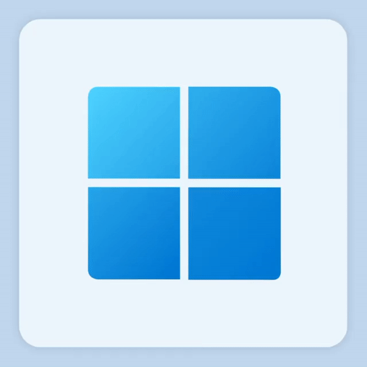

<!-- -------------------------------------- -->
<!-- Sección principal: presentación del perfil -->
<!-- -------------------------------------- -->

<h1 align="center">Hola &nbsp;, soy Sergio Eliseo</h1>

  

  Full-Stack Developer | Mobile & Web | Linux · Docker · SQL

<!-- Sección secundaria: redes sociales y contacto -->

  <h2>🌐 Conecta conmigo</h2>
  
¡Descubre mi trabajo y conecta conmigo en estas plataformas!

| GitHub | LinkedIn |
| --- | --- |
|  |  |

 

  

<!-- -------------------------------------- -->
<!-- Sección principal: información profesional -->
<!-- -------------------------------------- -->

<h2 align="center">🚀 Sobre mí</h2>
Egresado de la Licenciatura en Informática y desarrollador con experiencia en el ciclo completo de software (requerimientos → despliegue). Manejo tecnologías como Python/Flask, React, React Native y bases de datos SQL/NoSQL, con enfoque en despliegues mediante Docker y Linux. Apasionado por el trabajo colaborativo y la arquitectura de datos, busco seguir creciendo profesionalmente en equipos tecnológicos dinámicos.
 

<!-- Sección secundaria: estadísticas de GitHub -->

<h3 align="center">Estadísticas de Git</h3>

<!-- Racha de GitHub -->

 

<!-- Gráfico de actividad de GitHub -->

 

  <table>
    <tr>
      <td>
        
      </td>
      <td>
        
      </td>
    </tr>
  </table>

<!-- Tarjeta de resumen del perfil -->

### Gráfico de Contribuciones de GitHub

<!-- -------------------------------------- -->
<!-- Sección principal: tecnologías y herramientas -->
<!-- -------------------------------------- -->

<h1 align="center"> Stack Tecnológico</h1>

<!-- Sección secundaria: desarrollo web -->

<h3 align="center">Desarrollo Web</h3>

<table style="background-color: black; color: white; border: none; border-radius: 15px; overflow: hidden;">
  <thead>
    <tr>
      <th colspan="8" align="center" style="color: white;">
        Frontend
      </th>
    </tr>
  </thead>
  <tbody>
  <tr>
    <td align="center" style="border: none;">
      
       
      React
    </td>
    <td align="center" style="border: none;">
      
       
      React Native
    </td>
    <td align="center" style="border: none;">
      
       
      TypeScript
    </td>
    <td align="center" style="border: none;">
      
       
      Jinja2
    </td>
    <td align="center" style="border: none;">
      
       
      HTML5
    </td>
    <td align="center" style="border: none;">
      
       
      CSS3
    </td>
    <td align="center" style="border: none;">
      
       
      JavaScript
    </td>
    <td align="center" style="border: none;">
      
       
      Figma
    </td>
  </tr>
</tbody>
</table>

<table style="background-color: black; color: white; border: none; border-radius: 15px; overflow: hidden;">
  <thead>
    <tr>
      <th colspan="5" align="center" style="color: white;">
        Backend
      </th>
    </tr>
  </thead>
    <tbody>
    <tr>
      <td align="center" style="border: none;">
        
         
        Python
      </td>
      <td align="center" style="border: none;">
        
         
        Flask
      </td>
      <td align="center" style="border: none;">
        
         
        Node.js
      </td>
      <td align="center" style="border: none;">
        
         
        .NET
      </td>
      <td align="center" style="border: none;">
        
         
        JavaScript
      </td>
    </tr>
    <tr>
      <td align="center" style="border: none;">
        
         
        C#
      </td>
      <td align="center" style="border: none;">
        
         
        Java
      </td>
      <td align="center" style="border: none;">
        
         
        Kotlin
      </td>
      <td align="center" style="border: none;">
        
         
        C
      </td>
      <td align="center" style="border: none;">
        
         
        Express
      </td>
    </tr>
  </tbody>
</table>

  <table style="background-color: black; color: white; border: none; border-radius: 15px; overflow: hidden;">
    <thead>
      <tr>
        <th colspan="4" align="center" style="color: white;">Base de Datos</th>
      </tr>
    </thead>
    <tbody>
      <tr>
        <th colspan="4" align="center" style="color: white; border: none;">
          SQL / Relacionales
        </th>
      </tr>
      <tr>
        <td align="center" style="border: none;">
          
           
          MySQL
        </td>
        <td align="center" style="border: none;">
          
           
          MariaDB
        </td>
      </tr>
      <tr>
        <th colspan="4" align="center" style="color: white; border: none;">
          NoSQL / Big Data
        </th>
      </tr>
      <tr>
        <td align="center" style="border: none;">
          
           
          Apache Cassandra
        </td>
        <td align="center" style="border: none;">
          
           
          Hadoop
        </td>
      </tr>
    </tbody>
  </table>

<!-- Sección secundaria: computación en la nube y DevOps -->

<h3 align="center">Computación en la Nube y DevOps</h3>

<table style="background-color: black; color: white; border: none; border-radius: 15px; overflow: hidden;">
  <thead>
    <tr>
      <th colspan="5" align="center" style="color: white;">Contenerización y Orquestación</th>
    </tr>
  </thead>
  <tbody>
    <tr>
    <td align="center" style="border: none;">
      
       
      Docker
    </td>
    <td align="center" style="border: none;">
      
       
      Docker Compose
    </td>
    <td align="center" style="border: none;">
      
       
      NGINX
    </td>
    <td align="center" style="border: none;">
      
       
      Servidor Apache
    </td>
    <td align="center" style="border: none;">
      
       
      MinIO
    </td>
  </tr>
  </tbody>
</table>

<!-- Sección secundaria: Sistemas Operativos -->

<h3 align="center">Sistemas Operativos</h3>

<table style="background-color: black; color: white; border: none; border-radius: 15px; overflow: hidden;">
  <thead>
    <tr>
      <th colspan="7" align="center" style="color: white;">Sistemas Operativos</th>
    </tr>
  </thead>
  <tbody>
    <tr>
      <td align="center" style="border: none;">
        
         
        Windows
      </td>
      <td align="center" style="border: none;">
        
         
        Linux
      </td>
      <td align="center" style="border: none;">
        
         
        Debian
      </td>
      <td align="center" style="border: none;">
        
         
        Ubuntu
      </td>
      <td align="center" style="border: none;">
        
         
        Arch
      </td>
      <td align="center" style="border: none;">
        
         
        Manjaro
      </td>
      <td align="center" style="border: none;">
        
         
        Puppy Linux
      </td>
    </tr>
  </tbody>
</table>

<!-- Sección secundaria: Herramientas de IA e Ingeniería de Prompts -->

<h3 align="center">Herramientas de IA e Ingeniería de Prompts</h3>

  <table style="background-color: black; color: white; border: none; border-radius: 15px; overflow: hidden;">
    <thead>
      <tr>
        <th colspan="7" align="center" style="color: white;">Herramientas de IA e Ingeniería de Prompts</th>
      </tr>
    </thead>
    <tbody>
      <tr>
        <td align="center" style="border: none;">
          
           
          ChatGPT
        </td>
        <td align="center" style="border: none;">
          
           
          GitHub Copilot
        </td>
        <td align="center" style="border: none;">
          
           
          Claude
        </td>
        <td align="center" style="border: none;">
          
           
          Figma Make
        </td>
        <td align="center" style="border: none;">
          
           
          v0
        </td>
        <td align="center" style="border: none;">
          
           
          Google Gemini
        </td>
        <td align="center" style="border: none;">
          
           
          DeepSeek
        </td>
      </tr>
    </tbody>
  </table>

<h3>

</h3>